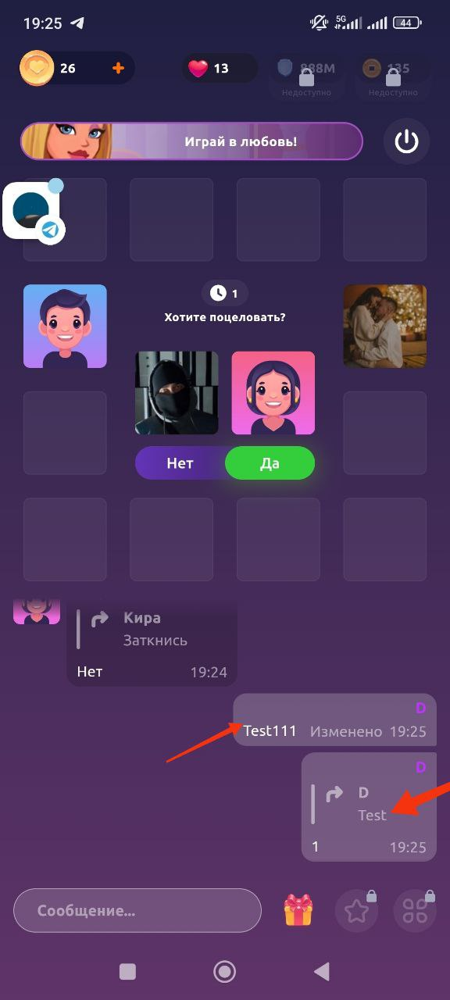
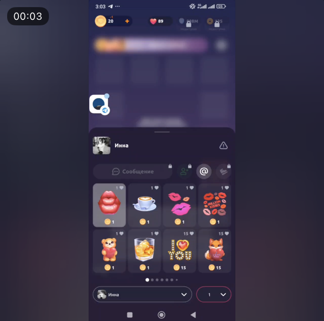
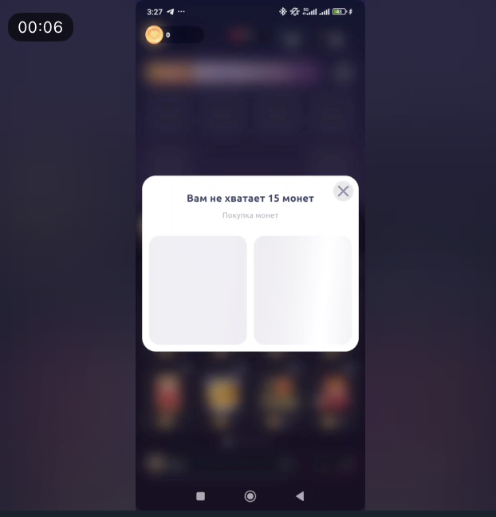

# Kiss Kiss App: Test Cases and Bug Reports

This repository contains detailed test cases and bug reports for the Kiss Kiss app. The goal is to ensure the app meets quality standards and provides a seamless user experience.

---

## Test Cases

### **Test Case 1: Entering the Game as a Guest**
- **Preconditions:**
    - Have an Android device.

- **Test Environment:**
    - Device: Xiaomi 12 X
    - OS: Android version 13

- **Test Steps:**
    1. Open the Kiss Kiss app.
    2. Tap on the "Play as Guest" option on the login screen.
    3. Enter a name (e.g., "Guest123").
    4. Tap on the "Enter Game" button.

- **Expected Results:**
    - The app accepts the entered name and loads the main game lobby.
    - The user is successfully entered into the game as a guest.
    - No email or password prompt appears during the process.

---

### **Test Case 2: Sending a Gift to Another Player**
- **Preconditions:**
    - Have an Android device.
    - Active account with sufficient balance to send a gift.

- **Test Environment:**
    - Device: Xiaomi 12 X
    - OS: Android version 13

- **Test Steps:**
    1. Log into the Kiss Kiss app with an already created user.
    2. Join an active game session.
    3. Tap on another player’s profile or avatar during the game.
    4. Select the “Send Gift” option.
    5. Choose a gift (e.g., "Flower" or "Heart") and confirm the action.

- **Expected Results:**
    - The selected gift is successfully sent to the chosen player.
    - The user’s balance is reduced by the correct amount corresponding to the gift cost.
    - The recipient sees the received gift in real-time with an appropriate notification.
    - If the balance is insufficient, an error message is displayed (e.g., "Insufficient balance to send this gift").

---

### **Test Case 3: Chat Message Sent Successfully**
- **Preconditions:**
    - Have an Android device.
    - Active user account.
    - Participation in a game.

- **Test Environment:**
    - Device: Xiaomi 12 X
    - OS: Android version 13

- **Test Steps:**
    1. Log into the Kiss Kiss app.
    2. Join an active game room.
    3. Open the in-game chat by tapping the chat icon.
    4. Type a message (e.g., "Hello, everyone!").
    5. Tap the "Send" button.

- **Expected Results:**
    - The message is sent successfully and immediately appears in the chat.
    - Other players in the room can see the message.
    - There are no delays or errors while sending the message.

---

## Bug Reports

### **Bug ID: 1 - Edited message does not update in replies**
- **Preconditions:**
    - User is logged into the Kiss Kiss app.
    - User is participating in a game session with chat enabled.

- **Priority:** Medium
- **Device:** Xiaomi 12 X, Android version 13

- **Steps:**
    1. Open the chat during an active game session.
    2. Send a message in the chat (e.g., "Hello").
    3. Have another user or yourself reply to the message.
    4. Edit the original message (e.g., change "Hello" to "Hi there").
    5. Observe the reply to the original message.

- **Expected Result:**  
  The reply should display the updated content of the edited message.

- **Actual Result:**  
  The reply still displays the original version of the message before it was edited.

---

### **Bug ID: 2 - Inconsistent table change behavior**
- **Preconditions:**
    - User is logged into the Kiss Kiss app.
    - User is participating in an active game session.

- **Priority:** High
- **Device:** Xiaomi 12 X, Android version 13

- **Steps:**
    1. Enter a random table in the game.
    2. Attempt to switch to another table immediately after joining.

- **Expected Result:**  
  The app consistently shows a notification or countdown (e.g., "You can change the table in X seconds") when attempting to change tables too quickly.

- **Actual Result:**  
  Inconsistent behavior:
    - Sometimes the table is switched immediately without any notification.
    - Other times, a notification appears with varying countdown times before the table can be changed.

---

### **Bug ID: 3 - Ability to send Gifts to players who have left the game**
- **Preconditions:**
    - User is logged into the Kiss Kiss app.
    - User is participating in an active game session.

- **Priority:** Medium
- **Device:** Xiaomi 12 X, Android version 13

- **Steps:**
    1. Join a random table in the game.
    2. Observe the chat where one of the players has sent a message.
    3. Wait for that player to leave the game.
    4. Tap on the avatar of the player who left.
    5. Tap the “Send Gift” button.

- **Expected Result:**  
  Sending gifts to users who are no longer in the game should be disabled. A notification like "This player is no longer in the game" should be displayed.

- **Actual Result:**  
  The app allows sending gifts to a user who has already left the game, despite their absence.

---

### **Bug ID: 4 - Sent gifts are not displayed in the chat**
- **Preconditions:**
    - User is logged into the Kiss Kiss app.
    - User is participating in an active game session.
    - User has sufficient balance to send gifts.

- **Priority:** High
- **Device:** Xiaomi 12 X, Android version 13

- **Steps:**
    1. Join a random table in the game.
    2. Select another player and send them a gift.
    3. Check the chat and notifications for any indication of the sent gift.

- **Expected Result:**
    - The chat should display a notification or message indicating that a gift was sent.
    - The recipient should see a notification or message about receiving the gift.

- **Actual Result:**
    - No indication of the sent gift appears in the chat or notifications.

---

### **Bug ID: 5 - Gift Menu Popup Cannot Be Closed After Repeated Gift Selection**
- **Preconditions:**
    - User is logged into the Kiss Kiss app.
    - User is participating in an active game session.

- **Priority:** High
- **Device:** Xiaomi 12 X, Android version 13

- **Steps:**
    1. Join a random table in the game.
    2. Tap on the gift icon to open the gift menu.
    3. Select the same gift 4 times consecutively.
    4. Observe the popup that appears.
    5. Attempt to close the popup by tapping the “X” button.

- **Expected Result:**  
  The popup should close immediately upon tapping the “X” button.

- **Actual Result:**  
  The popup cannot be closed by tapping the “X” button.

---
